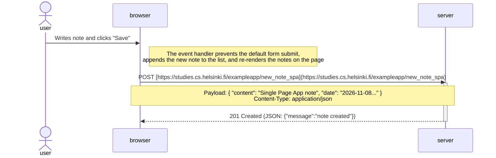

```mermaid
sequenceDiagram
    actor user
    participant browser
    participant server

    user->>browser: Writes note and clicks "Save"

    Note right of browser: The event handler prevents the default form submit,<br/>appends the new note to the list, and re-renders the notes on the page

    browser->>server: POST [https://studies.cs.helsinki.fi/exampleapp/new_note_spa](https://studies.cs.helsinki.fi/exampleapp/new_note_spa)
    activate server
    Note over browser,server: Payload: { "content": "Single Page App note", "date": "2026-11-08..." }<br/>Content-Type: application/json
    server-->>browser: 201 Created (JSON: {"message":"note created"})
    deactivate server
```